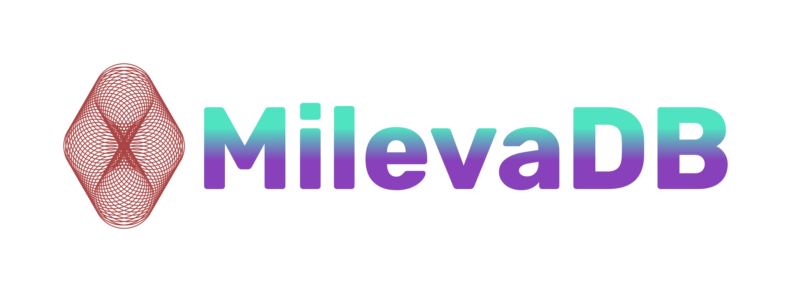

##This is a fork of MilevaDB by @CavHack copyrighted to WHTCORPS INC and EINSTAI; In consortia with OpenAI
## OSS Software offered as is, Enterprise edition available to subscribers of EinstAI Californium and Moscovium

## What is MilevaDB?

- __The transactions can span multiple tables__

 The go database is able to support any number of concurrent readers without locking, and allows a writer to make progress. MilevaDB supports rich transactions, in which multiple objects are inserted, updated or deleted. 

- __Cloud-Native and Serverless__

MilevaDB is designed to work in the cloud -- public, private, or hybrid -- making deployment, provisioning, operations, and maintenance simple. 

- __Favor availability over consistency in the presence of network partitions__

MilevaDB is a distributed database with a focus on high availability and horizontal scalability. It is based on egalitarian multi-paxos algorithm and optimized for writes.

##Write-optimized storage__

MilevaDN is a highly-available, distributed database that uses the Reliable Data Replication (RDR) protocol to provide consistent and reliable data.

MilevaDB is a distributed relational database. It is an ACID compliant transactional database that can be sharded and replicated across multiple nodes, with support for full cross-shard transactions.

It supports SQL queries and joins, as well as schema changes such as adding columns to tables without requiring downtime.

- __Graphs are hard to shard.__

The first challenge is to design a graph database that can be distributed across multiple machines. This requires us to have a mechanism for partitioning the data across the machines in such a way that each machine has only partial information about the graph, but still allows the machines to work together to answer queries.

The second challenge is that in a graph, the same entity can be connected to multiple other entities. In a relational database, this is not an issue because each row in a table has its own unique identifier and hence, it’s easy to identify the entity that is being referenced. However, in a graph, there is no such identifier and hence, it’s not possible to identify the same entity across multiple connections.

The third challenge is that in a graph database, there are two types of edges: directed and undirected. In a directed edge, the direction of the edge is important and hence, it’s not possible to simply join two tables based on an undirected edge.

-__Control Quota on tables that can be imported in parallel_

The DBS_JOBS table is the primary interface to the MilevaDB cluster. It provides both a current status and a short history of DBS operations across the cluster.

##SUSE meets FUSE with a bit of AllegroSQL

Each table is split into one "index engine" to store indices, and multiple "data engines" to store row data. These settings control the maximum number of tables that can be imported in parallel.

The system is designed to be a distributed, fault tolerant
relational graph database which uses a Key Value store as its data store provided by FoundationDB via EinsteinDB, which is designed to be used in the cloud and can handle billions of edges and vertices.

-__tl;dr_

tl;dr: We are building a distributed graph database that is optimized for traversing the graph from a small set of nodes to their neighbors, to their neighbors neighbors etc.

##What is the current state of the project?

We have a working prototype of the database, which is able to store and query graphs of up to a few million vertices and edges. We are currently working on a paper describing the database and its design.

##What are the short-term plans for MilevaDB?

We are currently working on a paper describing the database and its design.

##What is the long-term vision for MilevaDB?

The long-term vision is to build a distributed relational graph database that is optimized for embedding key-value hybrid indices, traversing the network from a small set of nodes to their neighbors, to their neighbors neighbors etc.

##How you plan to make it happen?

We are working on a paper describing the database and its design.

##Who we are:

We are a team of researchers at WHTCORPS INC and EINST.AI, led by Spencer Fogelman(UCLA), Josh Leder(Netflix), and Karl Whitford(Amazon/EinsteinDB). 